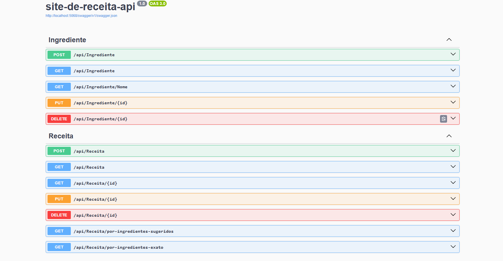

# 📚 API RESTful de Receitas Com ASP.NET 🍽️ + Docker 🐳

Esta API faz parte de um projeto pessoal sobre um site de receitas, desenvolvida em **.NET 8** para gerenciar **ingredientes** e **receitas**. O objetivo foi reforçar conhecimentos práticos em **ASP.NET Core**, **Entity Framework Core**, **PostgreSQL**, **Docker** e **arquitetura de APIs RESTful modernas**, permitindo executar a aplicação tanto localmente quanto em containers de forma fácil e segura.

---

## 📂 Sumário

* [⚒️ Tecnologias utilizada](#️-tecnologias-utilizada)
* [🔧 Funcionalidades](#-funcionalidades)
* [🗄️ Database Modeling](#️-database-modeling)
* [🗃️ Configuração da Conexão](#️-configuração-da-conexão)
* 🔍 Fazendo Requisições
  * [🍪 Ingrediente](#-gerenciamento-do-ingrediente)
  * [📔 Receita](#-gerenciamento-de-receitas)
* [🚀 Como Executar o Projeto](#-como-executar-o-projeto)
  * [📗 Documentação Swagger](#-documentação-swagger)
  * [🐳 Rodando com Docker](#-rodando-com-docker)
  * [🚫 Observações](#-observações)

---

## ⚒️ Tecnologias utilizadas

* .NET 8
* ASP.NET Core
* Entity Framework Core

  * Tools
  * Design
  * Npgsql
* PostgreSQL
* Docker & Docker Compose
* Swagger (para documentação da API)
* Git/GitHub

---

## 🔧 Funcionalidades

* **Ingrediente**

  * **Cria** um novo ingrediente
  * **Busca** todos os ingredientes
  * **Busca** os ingredientes pelo nome
  * **Atualiza** um ingrediente existente
  * **Deleta** um ingrediente
* **Receitas**

  * **Cria** uma nova receita
  * **Busca** todas as receitas
  * **Busca** a receita pelo id
  * **Busca** as receitas pelo nome
  * **Atualiza** uma receita existente
  * **Deleta** uma receita

---

## 🗄️ Database Modeling


---

## 🗃️ Configuração da Conexão

A API utiliza uma connection string para se conectar ao banco de dados PostgreSQL. Caso não for usar o docker configure a ConnectionStrings em `appsettings.json` ou `appsettings.Development.json`:

```json
{
  "ConnectionStrings": {
    "DefaultConnection": "Host=localhost;Port=5432;Database=SiteDeReceita;Username=${DB_User};Password=${DB_Password}"
  }
}
```

* **Host:**  `localhost`
* **Port:** `5432`
* **Database:** `SiteDeReceita`
* **Usuário:** seu usuário do PostgreSQL
* **Senha:** sua senha do PostgreSQL

---

## 🔍 Fazendo Requisições (api/Ingrediente)

### 🍪 Gerenciamento do Ingrediente

| Method    | Parameters | Action                                     |
| --------- | ---------- | ------------------------------------------ |
| 🟢 POST   | /          | Cria um ingrediente                        |
| 🟠 PUT    | /{id}      | Atualiza o ingrediente do id selecionado   |
| 🔵 GET    | /          | Retorna uma lista de todos os Ingredientes |
| 🔵 GET    | /{nome}    | Retorna o Ingrediente de acordo com o nome |
| 🔴 DELETE | /{id}      | Deleta o Ingrediente do id selecionado     |

### 🟢 Criando um Ingrediente

**Body (JSON):**

```json
{
  "fotoUrl": "string",
  "nome": "string"
}
```

---

## 🔍 Fazendo Requisições (api/Receita)

### 📔 Gerenciamento de Receitas

| Method    | Parameters         | Action                                                       |
| --------- | ------------------ | ------------------------------------------------------------ |
| 🟢 POST   | /                  | Cria uma Receita                                             |
| 🟠 PUT    | /{id}              | Atualiza a Receita do id selecionado                         |
| 🔵 GET    | /                  | Retorna uma lista de todos as Receitas                       |
| 🔵 GET    | /{id}              | Retorna a Receita do id selecionado                          |
| 🔵 GET    | /{ingredientesIds} | Retorna a Receita de acordo com os ingredientes selecionados |
| 🔴 DELETE | /{id}              | Deleta a Receita do id selecionado                           |

### 🟢 Criando uma Receita

**Body (JSON):**

```json
{
  "fotoUrl": "string",
  "linkTutorial": "string",
  "nome": "string",
  "descricao": "string",
  "tipo": 0,
  "ingredienteId": [ 0 ]
}
```

---

## 🚀 Como Executar o Projeto:

### 💻 Rodando localmente

#### 🔧 Pré-requisitos

- [SDK .net 8](https://dotnet.microsoft.com/pt-br/download/dotnet/8.0)
- [Postgres](https://www.enterprisedb.com/downloads/postgres-postgresql-downloads)

1️⃣ Clone o repositório:

```bash
git clone https://github.com/brunopaz8/site-de-receita-api.git
cd site-de-receita-api
```

2️⃣ Restaure pacotes e aplique migrations:

```bash
dotnet restore
dotnet ef database update
```

3️⃣ Execute a API:

```bash
dotnet run
```

A API estará disponível em: `http://localhost:5068`

---

### 🐳 Rodando com Docker

Você também pode executar a API e o banco PostgreSQL usando **Docker**.

#### 🔧 Pré-requisitos

- [Docker](https://docs.docker.com/desktop/setup/install/windows-install)
- Docker Compose

1️⃣ Clone o repositório:

```sh
git clone https://github.com/brunopaz8/site-de-receita-api.git
cd site-de-receita-api
```

2️⃣ Subir containers:

```bash
docker compose up -d --build
```

3️⃣ (opcional) Para ver os logs da API:

```bash
docker compose logs -f api
```

4️⃣  Parar containers:

1. Parar tudo (API + banco):

```bash
docker compose down
```

2. Parar tudo e apagar dados do banco:

```bash
docker compose down -v
```

#### ⚙️ Configuração do docker:

- **API** → estará escutando em `http://localhost:5068`
- **Postgres** → banco de dados rodando em container separado
- No Docker, a variável `APPLY_MIGRATIONS=true` garante que todas as migrations pendentes sejam aplicadas automaticamente.

---

### 📗 Documentação **Swagger**
A API conta com documentação interativa via **Swagger UI**, facilitando testes e visualização dos endpoints. Após iniciar a aplicação, acesse:

🟢 **Swagger UI:** [http://localhost:5068/swagger/index.html](http://localhost:5068/swagger/index.html)

📌 **Exemplo da interface Swagger UI:**


---

### 🚫 Observações

* Configure corretamente a `connectionString` no `appsettings.json` caso não for usar o docker.
* Execute migrations manualmente ao rodar localmente (`dotnet ef database update`).
* Certifique-se de que o PostgreSQL esteja em execução, seja localmente ou via Docker.
