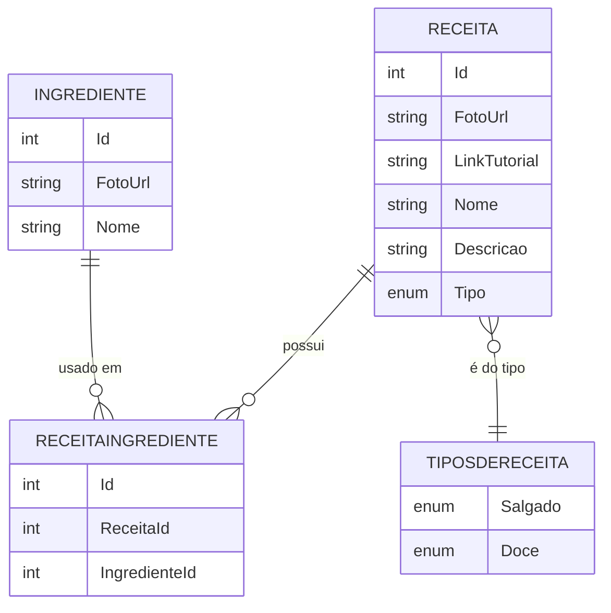

# 📚 API RESTful de Receitas Com ASP.NET 🍽️

Esta API faz parte de um projeto pessoal sobre um site de receitas, desenvolvida em **.NET 8** para gerenciar **ingredientes** e **receitas**. O objetivo foi reforçar conhecimentos práticos em **ASP.NET Core**, **Entity Framework Core**, **PostgreSQL** e **arquitetura de APIs RESTful modernas**.

---

## 📂 Sumário

- ⚒️ Tecnologias utilizada
- 🔧 Funcionalidades
- 🗄️ Database Modeling
- 🗃️ Configuração da Conexão
- 🔍 Fazendo Requisições:
  * 🍪 Ingrediente
  * 📔 Receita
- 🚀 Como Executar o Projeto
  - 📗 Documentação Swagger
  - 🚫 Observações
  
---

## ⚒️ Tecnologias utilizada

- .NET 8
- ASP.NET Core
- Entity Framework Core
  * Tools
  * Desing
  * Npgsql  
- PostgresSQL Server 
- Swagger (para documentação da API)
- Git/GitHub

---

## 🔧 Funcionalidades

- **Ingrediente**
  * **Cria** um novo ingrediente
  *  **Busca** todos os ingredientes
  *  **Busca** os ingredientes pelo nome
  *  **Atualiza** um ingrediente existente
  *  **Deleta** um ingrediente
- **Receitas**
  * **Cria** uma nova receita
  *  **Busca** todas as receitas
  *  **Busca** a receitas pelo id
  *  **Busca** as receitas pelo nome
  *  **Atualiza** uma receita existente
  *  **Deleta** uma receita

---

## 🗄️ Database Modeling



---

## 🗃️ Configuração da Conexão

A API utiliza uma connection string para se conectar ao banco de dados PostgreSQL. Configure em `appsettings.json` ou `appsettings.Development.json`:

```json
{
  "ConnectionStrings": {
    "DefaultConnection": "Host=localhost;Port=5432;Database=SiteDeReceita;Username=${DB_User};Password=${DB_Password}"
  }
}
```

- **Host:**  `localhost`
- **Port:** `5432`
- **Database:** `SiteDeReceita`
- **Usuário:** seu usuário do PostgreSQL
- **Senha:** sua senha do PostgreSQL

---

## 🔍 Fazendo Requisições (api/Ingrediente)

###  🍪 Gerenciamento do Ingrediente

| Method | Parameters | Action                                         |
| ------ | ---------- | --------------------------------------------  |
|🟢 POST   | /          | Cria um ingrediente                         |
|🟠 PUT    | /{id}      | Atualiza o ingredinte do id selecionado     |
|🔵 GET    | /          | Retorna uma lista de todos os Ingredientes  |
|🔵 GET    | /{nome}    | Retorna o Ingrediente de acordo com o nome  |
|🔴 DELETE | /{id}      | Deleta o Ingrediente do id selecionado      |


### 🟢 Criando um Ingrediente

**Body (JSON):**
```json
{
  "fotoUrl": "string",
  "nome": "string"
}
```

---

## 🔍 Fazendo Requisições (api/Receita)

###  📔 Gerenciamento de Receitas

| Method | Parameters | Action                                         |
| ------ | ---------- | ---------------------------------------------  |
|🟢 POST   | /          | Cria uma Receita                            |
|🟠 PUT    | /{id}      | Atualiza a Receita do id selecionado        |
|🔵 GET    | /          | Retorna uma lista de todos as Receitas      |
|🔵 GET    | /{id}      | Retorna a Receita do id selecionado           |
|🔵 GET    | /{ingredientesIds} | Retorna a Receita de acordo com os ingredientes selecionados        |
|🔴 DELETE | /{id}      | Deleta a Receita do id selecionado          |

### 🟢 Criando uma Receita

**Body (JSON):**
```json
{
  "fotoUrl": "string",
  "linkTutorial": "string",
  "nome": "string",
  "descricao": "string",
  "tipo": 0,
  "ingredienteId": [ 0 ]
}
```

---

## 🚀 Como Executar o Projeto:

1️⃣. Clone o repositório

```bash
git clone https://github.com/brunopaz8/site-de-receita-api.git
cd site-de-receita-api
```

2️⃣. Restaure os pacotes e rode as migrations

```bash
dotnet restore
dotnet ef database update
```

3️⃣. Execute o projeto

```bash
dotnet run
```

A API estará disponível em: `https://localhost:5068` ou `http://localhost:5068/swagger/index.html`

---

### 📗 Documentação **Swagger**
A API conta com documentação interativa via **Swagger UI**, facilitando testes e visualização dos endpoints. Após iniciar a aplicação, acesse:

🟢 **Swagger UI:** [http://localhost:5068/swagger/index.html](http://localhost:5068/swagger/index.html)

📌 **Exemplo da interface Swagger UI:**


---

### 🚫 Observações

* Certifique-se de configurar corretamente a `connectionString` no `appsettings.json`.
* Execute `dotnet ef database update` antes de rodar a API.
* Certifique-se de que o PostgreSQL esteja em execução.


